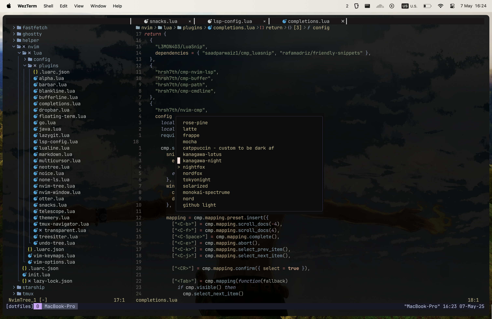

# My MacOS Configurations

My personal dotfiles repository containing configuration files for various tools and applications I use daily. These are the configs I spend 90% of my time in — obsessively tuned, occasionally broken, and always evolving.

## Future Enhancements

Stuff I'd love to add if I had more time (and motivation):

- **GNU Stow**: Heard about this symlink management tool ages ago, but my current `link.sh` works just fine. So I'm in no rush.
- **Nix**: The holy grail of reproducible environments. Sounds amazing, but learning Nix feels like learning a new language. Maybe next year?

## License

This project is licensed under the MIT License - see the [LICENSE](LICENSE) file for details.

## Contributing

Feel free to open issues or submit pull requests if you have suggestions for improvements.
